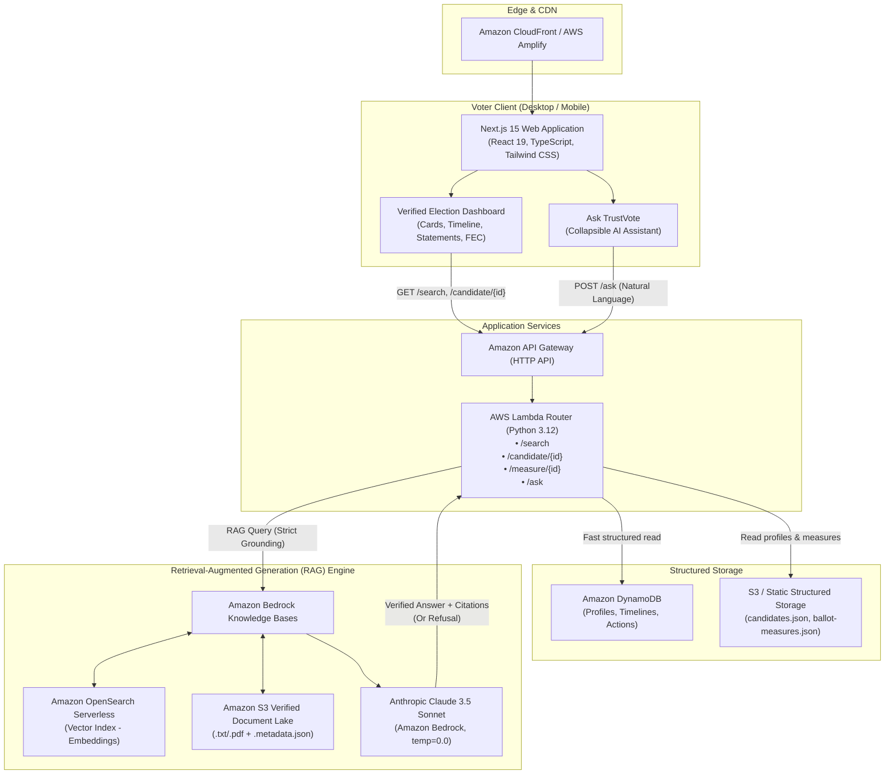

# TrustVote System Architecture

> **Guiding Principle:** *Dashboard First, AI Second.*
> TrustVote is designed as an interactive, nonpartisan public election information dashboard. AI acts exclusively as an on-demand, secondary side-panel assistant with strict retrieval-augmented generation (RAG) and zero-hallucination refusal guarantees.

---

## 1. High-Level Architecture Diagram

---

## 2. Core Components

### 2.1 Frontend (Next.js 15 + React 19 + TypeScript)
- **Dashboard First**: Voters primarily navigate structured cards with direct links to government filings, legislative votes, and campaign disclosures.
- **Collapsible AI Side-Panel**: A slide-out drawer powered by Bedrock RAG. Does not obstruct primary dashboard data.
- **Civic Government Aesthetic**: Clean, high-legibility styling using navy `#0F2942`, white/slate backgrounds, and emerald verification badges.
- **Accessibility Engine**:
  - High-contrast mode toggle
  - Large-text mode toggle
  - Screen reader semantic markup (`aria-live`, `aria-describedby`, landmark roles)
  - Full keyboard navigable focus rings

### 2.2 API Layer (Amazon API Gateway + AWS Lambda)
- **Serverless**: Zero idle cost, auto-scaling, no EC2/ECS/Kubernetes required.
- **REST Endpoints**:
  - `GET /search?q={query}`: Multi-entity search across candidates, ballot propositions, and policy topics.
  - `GET /candidate/{id}`: Returns complete verified candidate dossier (biography, campaign finance, roll-call votes, official quotes).
  - `GET /measure/{id}`: Returns certified ballot measure breakdown (yes/no meanings, fiscal impact, official sponsor arguments).
  - `POST /ask`: Executes verified RAG against Bedrock Knowledge Base.

### 2.3 RAG & Bedrock Knowledge Base
- **Knowledge Base Storage**: Amazon S3 bucket containing official government publications, Congressional hearing transcripts, FEC filings, and state ballot pamphlets.
- **Vector Search**: Amazon OpenSearch Serverless collection indexing document embeddings (Titan / Cohere Embeddings).
- **Strict Claude 3.5 Sonnet Invocations**:
  - Temperature set to `0.0`.
  - Zero extrapolation outside retrieved text.
  - Mandatory refusal if query falls outside verified corpus:
    > *"I don't have enough verified information to answer this question. Please consult official government election resources at your state election office."*

---

## 3. Data Flow Comparison

| Feature | Primary Dashboard Flow | AI Side-Panel Flow |
| :--- | :--- | :--- |
| **Trigger** | Page navigation, search select, tab clicks | Voter asks natural language question |
| **Engine** | Structured JSON / DynamoDB | Amazon Bedrock Knowledge Base + Claude 3.5 Sonnet |
| **Output Type** | Cards, interactive timeline, charts, quote tables | Grounded synthesis with clickable source badges |
| **Generation Risk** | Zero (100% deterministic source data) | Guardrailed RAG with refusal on unverified facts |
| **Sources** | Displayed on every single card and data row | Displayed with publication date, tier, and direct URL |
